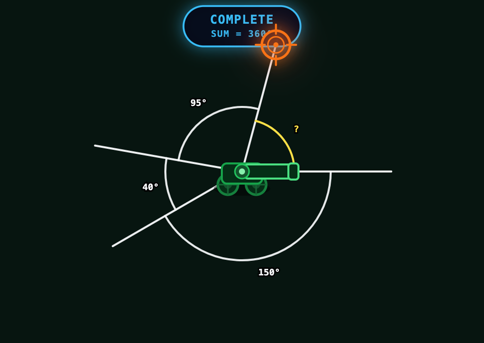

# Angle Explorer



> An arcade-style maths game where learners rotate a cannon, read angle values, and solve angle questions by aiming and firing.

## What It Is

Angle Explorer is an interactive maths game built as a Progressive Web App. A cannon rotates from a fixed base, and the player uses dragging and keypad input to aim at targets while learning how different angles behave.

The game is designed to move from visual intuition to calculation:
- **Level 1** — recognise angle types by sight and aim the cannon by dragging
- **Level 2** — compute missing angles in complementary, supplementary, and complete-rotation sets
- **Level 3** — angle reasoning with less visual scaffolding (planned)

## Curriculum

| Level | NSW Stage | Code | Skill |
|-------|-----------|------|-------|
| 1 | Stage 2 (Years 3–4) | MA2-16MG | Identifies, describes, compares and classifies angles |
| 2 | Stage 3 (Years 5–6) | MA3-16MG | Measures and constructs angles; applies angle relationships to find unknowns |
| 3 | Stage 4 (Years 7–8) | MA4-18MG | Identifies and uses angle relationships including transversals |

## How to Play

1. Read the question prompt.
2. Drag the cannon to aim, or type the angle on the keypad.
3. Press Fire to shoot at the target.
4. Collect stars by answering correctly.
5. Survive the Platinum Round (typed answers only) to unlock the Monster Round.
6. Clear the Monster Round to complete the level.

## Tech Stack

- React 19 + TypeScript
- Vite 8 + Tailwind CSS v4
- SVG-based game scene (no canvas)
- Web Audio API for synthesised sound
- jsPDF for session reports
- Vercel serverless functions for email delivery
- PWA (installable, offline-capable)

## Running Locally

```bash
npm install
npm run dev
```

The app runs on `http://localhost:4002`.

## Building

```bash
npm run build
npm run preview
```

## Specs

See the [`specs/`](./specs/README.md) folder for the full technical specification,
including game loop, question logic, sound system, autopilot, and the planned i18n feature.
